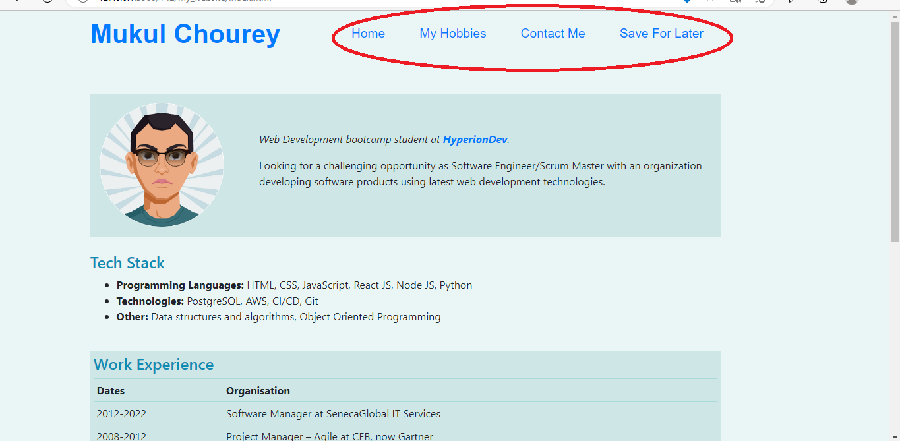

# My Website

This website describes my brief bio and hobbies. This project showcases my leraning of key 
Javascript concepts so far. This website uses localStorage to save and display certain information
across sessions.

# Table of Contents
1. [About Me](#title)  
    1.1. [Home](#home)  
    1.1. [My Hobbies](#hobbies)  
    1.1. [Save for Later](#later)  
    1.1. [Contact Me](#contact)  
1. [Installation Instructions](#install)
1. [User Manual](#manual)
1. [Credits and References](#ref)
   
   
## About Me 
I am a Web Development bootcamp student at HyperionDev.

I am looking for a challenging opportunity as Software Engineer/Scrum Master with an organization developing software products using latest web development technologies.
### Home 
This page lists down my core skills, work experiece and educational qualifications and certifications.

### My Hobbies 
If you want to know about what I do in free time, this is the page to visit. I implemented bootstrap carousal in this page.

Here, there are few external links available for you to save for later read.

### Save for Later 
Here you can find all the external liks that you have saved in the hobbies page. I impletemented localStorage concept in this page, 
which means even if you ends your browser session, the application will remember your save for later links.

### Contact Me 
Here, you can fill the form to provide your contact details, and I will reach out to you as soon as possible.

## Installation Instructions 
This website is consists of HTML, CSS and Javasript files. Keep the same directory structure in your Visual Studio code, and run index.html.

## User Manual 
You can use the top menu to navigate between various pages.

 
You can save external links on the Hobbies page by clicking 'Save for Later' link.

## Credits and References 
Credits: [HyperionDev](https://www.hyperiondev.com/)

References: 
[Basic writing and formatting syntax](https://docs.github.com/en/get-started/writing-on-github/getting-started-with-writing-and-formatting-on-github/basic-writing-and-formatting-syntax)

[TOC](https://stackoverflow.com/questions/11948245/markdown-to-create-pages-and-table-of-contents)
